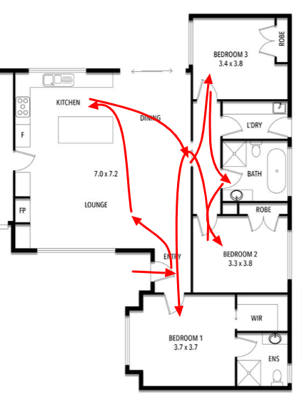
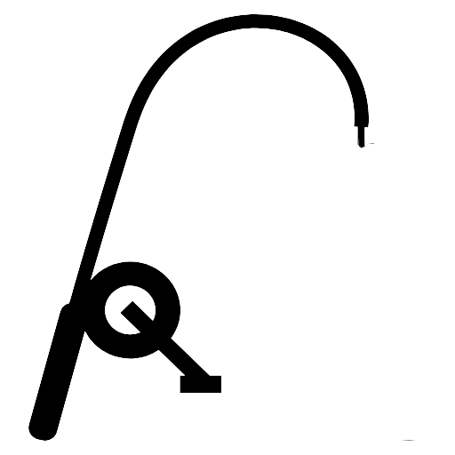

Have you noticed that every day there seems to be more to remember – more names, things to do, shopping items, passwords, car registrations or telephone numbers? If you’re like me, much of the information you are inundated with goes in one ear and out the other. Perhaps that can be a good thing – there are things one would rather forget, like embarrassing moments.

Most of the books and articles about memory seem to have been written by people within the “memory elite” – memory experts and memory competition enthusiasts. In this article I will present some simple methods I found in the voluminous material about memory. Methods you and I can use every day.

I was fascinated by apparent memory feats whilst I was working with a colleague, our qualitative research executive. He revelled in impressing everyone with his party trick, recalling up to ten objects in any order. He kept his technique a closely guarded secret, whilst he enjoyed the admiration. I don’t remember his name, though, because I hadn’t learned the technique for remembering names!

His “secret” party trick is revealed below in the Rhyming Number Peg System.

I’m sure you have heard about people like Ben Pridmore, the former world memory champion. He broke the 30 seconds barrier when he memorised the order of an entire shuffled deck of cards and recalled them in order in 26 seconds. We may not all be potential memory champions, but we are all capable of amazing memory feats.

_Simonides of Ceos_Let’s go back a little, 2500 years or so, to the time of Simonides of Ceos. He was the Ancient Greek lyric poet, who lived from 556 to 468 BC.

Simonides was at a feast hosted by one of his patrons when he was called out of the feast hall to see two visitors who had arrived and were asking for him. As soon as he left the hall, it collapsed, killing everyone inside. During the subsequent excavation of the rubble of the dining hall, Simonides was called upon to identify each person killed. Their bodies had been crushed beyond recognition, but he completed the gruesome task by correlating their identities to their positions (loci in Latin) at the table before his departure. This events were said to have inspired him to develop a system of mnemonics based on images and places called the method of loci (today known as the memory theatre or memory palace).

Themistocles wasn’t so impressed!

> I would rather a technique of forgetting, for I remember what I would rather not remember and cannot forget what I would rather forget.
>
> _Themistocles, according to Cicero_

There is even a name for Themistocles’ problem - Hyperthymestic syndrome. People with this condition can recall daily events nonstop, uncontrollably, and automatically. It is apparently an exhausting affliction.

I became more interested in memory and memory techniques when I came across Tony Buzan’s book “Use Your Memory”. He was the man who invented the Mind Mapping technique. He also co-founded the World Memory championships, which have been going for over 33 years.

One of the champions was Joshua Foer, who used to be like most of us, forgetting phone numbers and mislaying keys. Then he learnt the art of memory training, and a year later found himself in the finals of the US Memory Championship. He also discovered a truth we often forget- that, even in an age of technology, memory is the key to everything we are.

Another was Ed Cooke, a young memory grand master from England. He was asked whether he had a photographic memory. He laughed before answering: “Photographic memory is a detestable myth. Doesn't exist. In fact, my memory is quite average. All of us here have average memories. What you should understand is that even average memories are remarkably powerful if used properly”. This was after he had recited back 252 random digits as effortlessly as if they’d been his own telephone number.

The closest thing to photographic memory (which has been proven to not exist) is eidetic memory, the ability to recall vivid details of an image briefly after seeing it. It's often seen in children, including those with developmental difficulties, who can recall an image in great detail for a short period of time.

I am always amazed at how my golf mates and I can remember the score we had, hole by hole, after each round of golf. The score we had for each hole the previous week is replaced in our memories. We do so by visualising each hole. This gives a clue about how memories work and their principles.

### Principles of Memory

To use any of the memory techniques, one needs to apply some principles. The memory elite have quite a long list of principles. For me, the most useful ones are:

- Exaggeration – transform the object into a huge (or a tiny) version, or many repeats of the object. For example, the carrots on the shopping list become a field full of carrots stretching as far as the eye can see.
- Kinaesthesia – the object’s movement in space. A dancing garden hose is more memorable on the task list.
- Sensory – vision, hearing, smell, taste, touch. Imagine the object’s sound, for example, when adding vacuuming the carpet to the task list.
- Association – for me, this is the most powerful. Linking the item to something stable in your mental environment is amazingly effective. I have found that this is the most important principle when remembering names.

### Association - The Building Blocks of Memory

Memory works best by using “pegs” - stable images that can be associated with the item to be remembered.

A good example is remembering names.
Linking the name of a car to something that “sounds like” the name works for me. A Toyota Camry sounds like a camera, so you could visualise a huge camera on a tripod.

The pegs used for each memory item are personal to you. For example, we have a French backpacker working in hospitality in our local town. Her name is Juliet, a name that isn’t common here. For reasons I cannot fathom, I associate it with Shakespeare’s play “Romeo and Juliet”. Now it’s easy to remember, particularly because I have used repetition to reinforce my memory, by using her name every time I see her.

As for all memory tasks, it takes a small amount of effort to make associations, but it is so nice to be seen as good at remembering names.

### Mnemonics

Mnemonics are a good way to remember discrete things, like processes. Like the sales process – Awareness, Interest, Desire, Action (AIDA, pronounced Eye-Ee-Dah).

I’m sure you remember some of the mnemonics you were taught as a child. These probably started with learning the “A-B-C” song, a good example of the sensory method “sound”.

Sound and rhymes tend to be used in most mnemonics. Think about:

- ROY G BIV – red, orange, yellow, green, blue, indigo and violet - the colours of the rainbow
- BIDMAS – brackets, indices, division, multiplication, addition, subtraction – the order in which equations should be solved.
- “i” before “e” except after “c” - to remember spelling

These examples roll off the tongue and are memorable as a result.

Making up your own mnemonics isn’t too hard. It may just require breaking up the letters into “words” or letters that sound memorable. This is called “chunking” and it is often used to remember numbers, like mobile phone numbers.

### The Memory Palace

Simonides’ Method of Loci is particularly powerful. It has certainly stood the test of time, lasting 2500 years and still going strong.
Today it is best known as the Memory Palace. All that is required for a “palace” is that it has “rooms”. The golf course example (above) for remembering scores is an example of a memory palace. Its rooms are its eighteen greens.

The route from green to green is predetermined – 1 then 2, etc. However, using your home as a memory palace will require a route as well (if you need to remember the order of items). You may decide that this route is first lounge room, then kitchen, then dining room, then guest bedroom, and so on.

Another memory palace could be your regular train route to work, with the stations en route as “rooms”.

Just place the items you want to remember inside each room.

This brings us to the two main techniques for remembering item lists, both of which employ sensory devices and pegs. I use these for shopping lists and to do lists.

### The Rhyming Number Peg System

This system uses images of things that rhyme with the numbers 1 to 10. I use it for the first ten items on a list.

To remember a list, associate each item with the corresponding peg.

| Number |   Peg    | Number |          Peg           |
| :----: | :------: | :----: | :--------------------: |
|   1    | Bun/Gun  |   6    | Sticks/ Drum Sticks |
|   2    |   Shoe   |   7    |         Heaven         |
|   3    | Tree/Bee |   8    |          Gate          |
|   4    |   Door   |   9    |       Vine/Wine        |
|   5    |   Hive   |   10   |          Hen           |

How I would use it for a shopping list of ingredients for dinner. The first three items may be:

- Fish – a huge, fresh-smelling, salmon sandwiched between an open burger bun, like a bizarre fast-food burger.
- Potatoes – a pair of dancing ballet shoes filled with tiny new potatoes.
- Vegetables – a large Oak tree with a variety of different, colourful vegetables replacing the acorns.

Try it – you will be amazed at how easy it is to implement. Once you have the ten rhyming images memorised, it takes much less time and effort than you think. And, it is easy to remember items out of sequence. “What was two”, “what was seven”, and so on.

> The best results are achieved by using the right amount of effort in the right place at the right time. And this right amount is usually less than we think we need.
>
> _Tony Buzan_

### The Number Shape Peg System

I use this system for list items 11 to 20, which means that I use it less often. However, it is just as powerful as the Rhyming Number System because it uses memorable images.

| Number |                                                               Shape                                                               | Number |                                                                 Shape                                                                 |
| :----: | :-------------------------------------------------------------------------------------------------------------------------------: | :----: | :-----------------------------------------------------------------------------------------------------------------------------------: |
|   1    |    _Candle_    |   6    | _Fishing Rod_ |
|   2    |      _Swan_      |   7    |       _Cliff_       |
|   3    | _Moustache_ |   8    |     _Snowman_     |
|   4    |     _Yacht_     |   9    | _Toilet Roll_ |
|   5    |     _Snake_     |   10   | _Bat & Ball_  |

You can personalise these images too. For me, one isn’t a candle, it is the TV tower in the city of Sydney. It seems to be iconic in any tourist photo of the city centre.
To use this system for a daily task list, for example, the first three items could be:

- Mow the lawn – your lawn has sprouted little candles, like mine sometimes sprouts mushrooms after sustained rain in winter.
- Tidy the shed – a large swan’s nest has appeared on the roof of the shed, full of noisy, flapping swans.
- Write a report – the cover of the report features Groucho Marx, one half of the Marx brothers and renowned for his moustache.

Mastering your memory is so much more than just about memory. Being able to remember names improves your social interactions. Using the supermarket checkout person’s name results in a noticeable lift in their demeanour when talking to you. Whilst forgetting things one should remember can be frustrating, remembering things most people don’t is confidence-boosting. All it requires is a system of pegs and the simple principles of memory.

It also provides you with a party trick and one you can easily teach your kids!

Start small, start simple, start by dumping written shopping lists.
